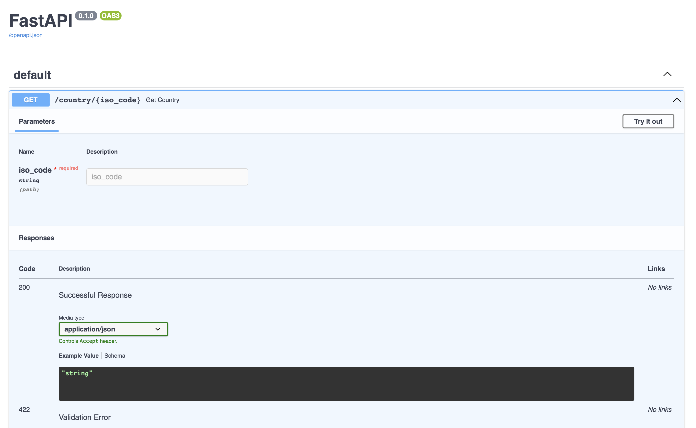
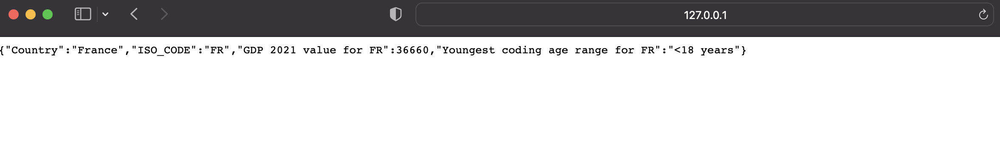

# Part II

### In part II folder 
```bash
python3 main.py
```
Starts uvicorn server on :8000 port, docs located at 127.0.0.1:8000/docs, supported geo codes available
in constants.py GEO_CODES dict, the GDP value returned for 2021 year.



Response example for FR code:



## Ways of service scalability

### Horizontal scaling 
Horizontal scaling means that you scale by adding more machines into your pool of resources 
whereas Vertical scaling means that you scale by adding more power (CPU, RAM) to an existing machine.

### Vertical scaling 
Vertical scaling refers to adding more resources (CPU/RAM/DISK) to your server 
(database or application server is still remains one) as on demand. Vertical Scaling is most commonly used in 
applications and products of middle-range as well as small and middle-sized companies.

###As far as service written in FastAPI, the async support available from buitlin types and python functions.