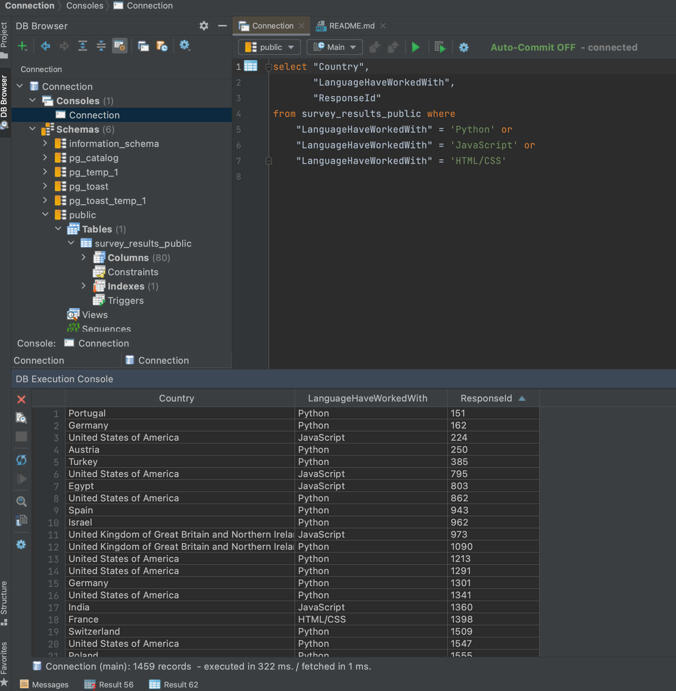

# Part III

Requirements installation(Docker, Docker compose)
--------------------------------------
Link for Docker installation: 
https://docs.docker.com/engine/install/

Link for Docker Compose installation:
https://docs.docker.com/compose/install/

### In part III folder 
```bash
docker-compose up 
```
Brings up the container from image of postgresql 11 version with defined DB_NAME, USER, PASSWORD;
exposes port 5432 in container to 5432 port on local machine.

```bash
python3 csv_to_table_exporter.py
```
Create table from CSV survey_results_public.csv. DB can be accessed via any DB tool, for instance, 
DB Browser in my case



Unfortunately, in this part I was able to extract only Country and Language, tried to use crosstab function for
postgres case, but guess I missed something(have not so much experience in SQL): https://dbfiddle.uk/pjZBf21F
